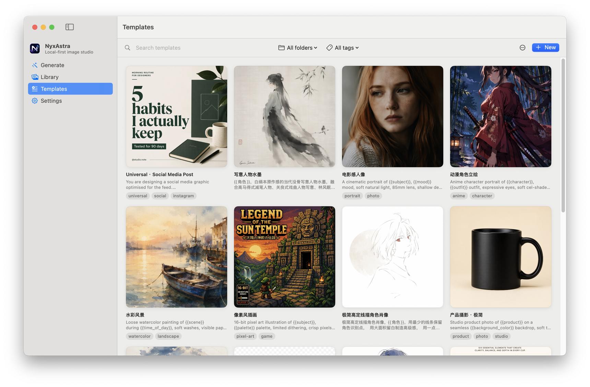
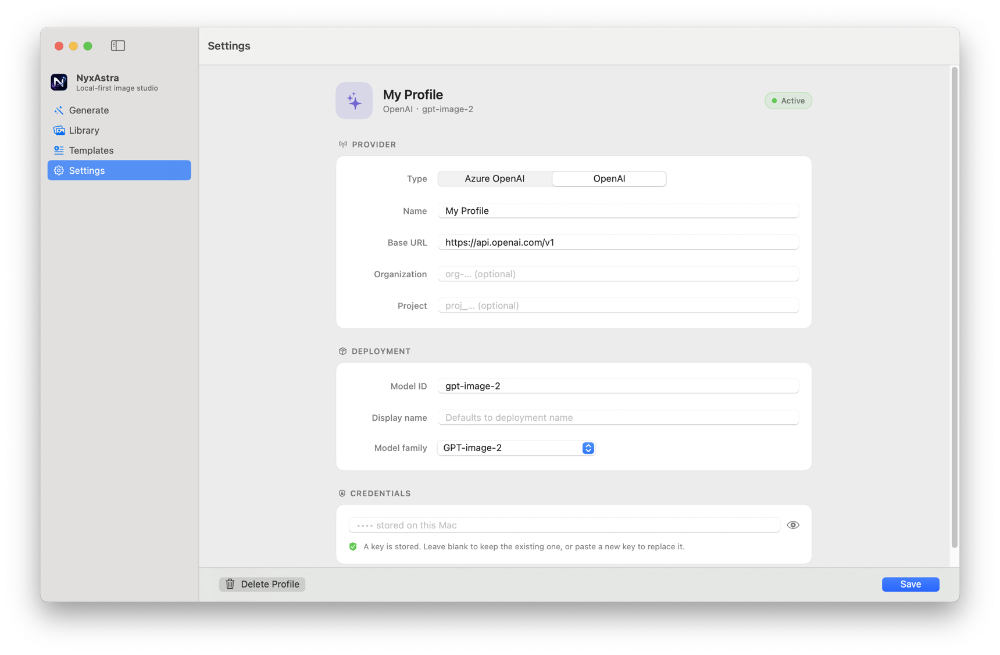

  

<h1 align="center">NyxAstra</h1>

  <strong>Local-first GPT-Image studio for macOS</strong> 
  Generate, organize, and export AI images — your API key, your Mac, your data.

  

  
  
  

---

## Screenshots

| Generate | Library | Templates |
|:---:|:---:|:---:|
|  |  |  |

| Use Template | Settings |
|:---:|:---:|
|  |  |

---

## Features

**Image Generation**
- Full parameter control: quality, size (up to 4K), format, background transparency, moderation
- Supports gpt-image-2, gpt-image-1.5, gpt-image-1
- Reference image editing — drag & drop to guide generation
- Real-time token usage tracking

**Prompt Templates**
- 12 curated starter templates with fill-in variables
- Create, import, and export your own (.nyxtemplate)
- Folder organization with drag-to-reorder
- Live cover preview from generation results

**Library**
- Browse all generations with full metadata
- Tag, rate (1-5 stars), search, and filter
- Batch select, export, and delete
- Embedded PNG/JPEG metadata for every image

**Privacy & Security**
- No backend server, no telemetry, no analytics
- API keys encrypted locally with AES-256-GCM
- All data stays in your Mac's app sandbox
- Network requests go only to your configured OpenAI or Azure OpenAI endpoint

## System Requirements

- macOS 14.0 (Sonoma) or later
- Apple Silicon or Intel Mac
- Your own OpenAI or Azure OpenAI API key

## Download

Download the latest `.dmg` from [**Releases**](https://github.com/gavinvonmandias/nyxastra-app/releases/latest).

## Links

- [Product Page](https://gavinschneestudio.com/products/nyxastra.html)
- [Gavin Schnee Studio](https://gavinschneestudio.org/)
- [Privacy Policy](PRIVACY.md)
- [Changelog](CHANGELOG.md)
- [FAQ](FAQ.md)

## Feedback

Found a bug or have a feature idea? [Open an issue](https://github.com/gavinvonmandias/nyxastra-app/issues/new/choose).

---

  &copy; 2026 Gavin Schnee Studio. All Rights Reserved.

