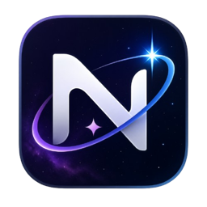
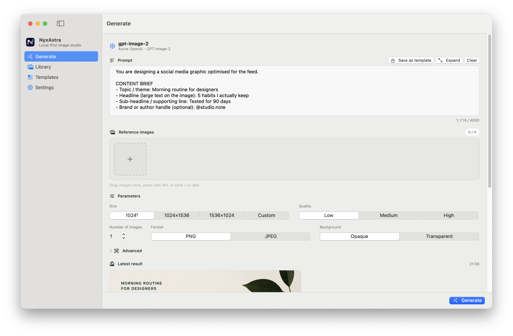
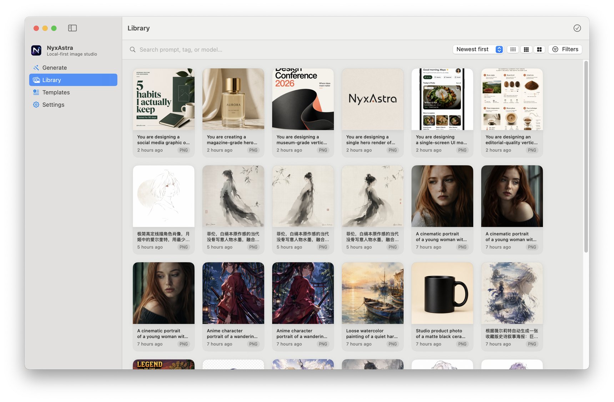
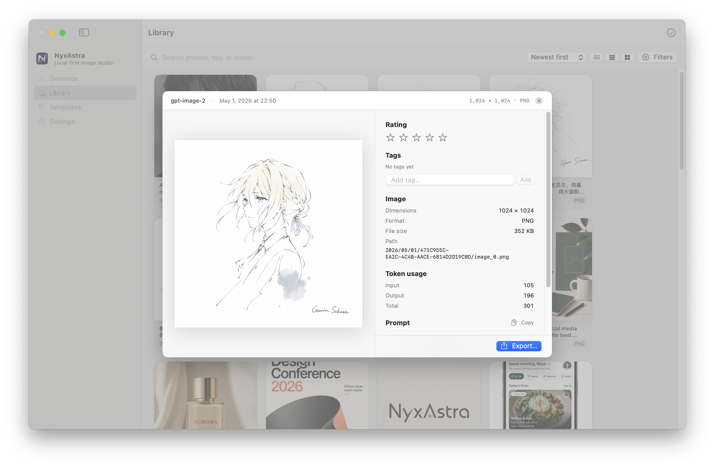
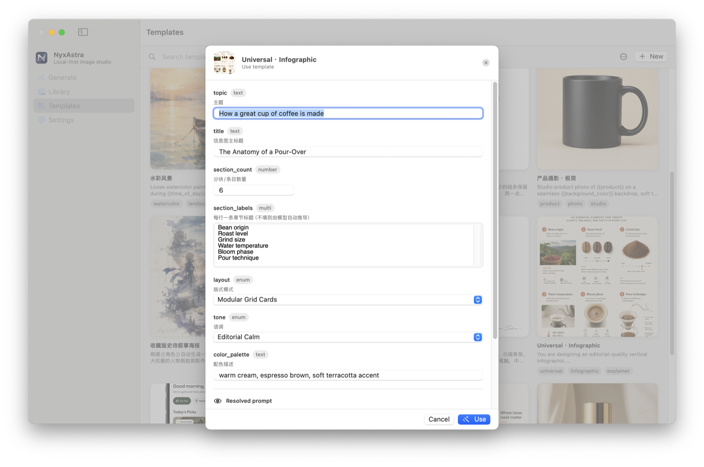
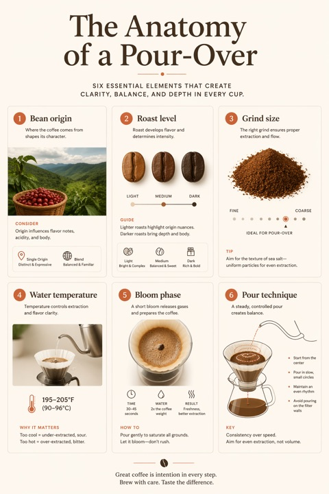
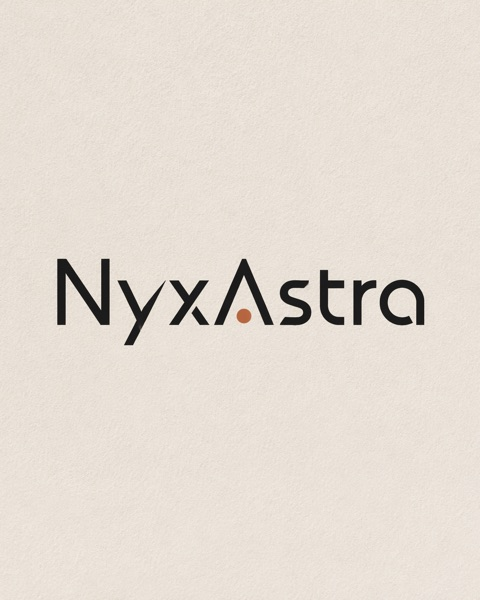
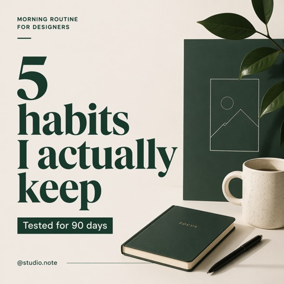
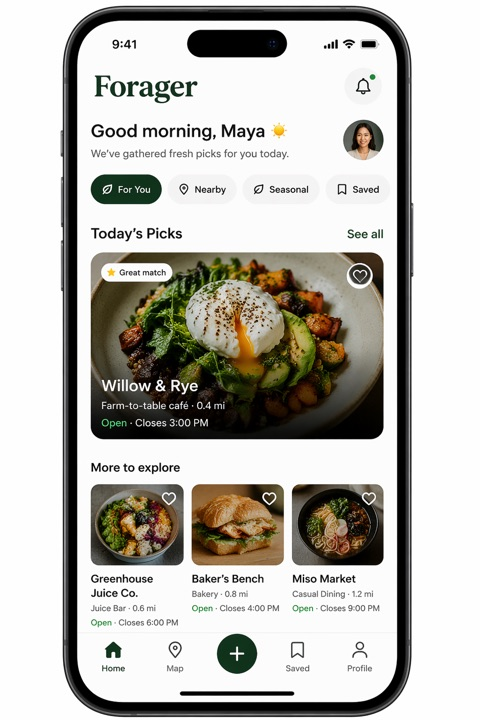

  

<h1 align="center">NyxAstra</h1>

  <strong>The AI image studio that stays on your Mac.</strong> 
  Generate stunning images with GPT-Image-2 — no cloud, no subscriptions, no data leaves your machine.

  
  &nbsp;&nbsp;
  

  
  
  
  
  

---

  <video src="assets/demo.mp4" width="720" autoplay loop muted playsinline>
    
  </video>

  

## Why NyxAstra?

Most AI image tools lock you into a web app, charge monthly fees, and route everything through their servers. **NyxAstra is different:**

- **Your API key, your control.** Connect your own OpenAI or Azure OpenAI account. No middleman, no markup.
- **Nothing leaves your Mac.** Zero telemetry. Zero analytics. Images and credentials stored locally with AES-256 encryption.
- **Native macOS experience.** Built with SwiftUI — fast, lightweight, and feels like it belongs on your Mac.
- **Free.** No trials, no feature gates, no subscriptions.

---

## What you can do

### Generate up to 4K images

Full parameter control — quality, size, format, transparent backgrounds, moderation. Supports **gpt-image-2**, gpt-image-1.5, gpt-image-1, and gpt-image-1-mini.

  

### Edit with reference images

Drag & drop reference images to guide the AI. Perfect for style transfer, variations, and iterative refinement.

### Organize everything in the Library

Tag, rate, search, filter, batch export. Every image keeps its full generation metadata embedded in the file — prompt, parameters, token usage, model, and timestamp.

  

  

### One-click prompt templates

Don't start from a blank prompt. NyxAstra ships with **15 curated templates** covering cinematic portraits, pixel art, watercolor landscapes, product photography, logo design, and more. Each template has **fill-in variables** — just type your subject and hit Generate.

  

**Want more?** Browse the **[Template Gallery](templates/)** for community-contributed templates:

| | | |
|:---:|:---:|:---:|
|  |  |  |
| Event Poster | Infographic | Logo Concept |
|  |  |  |
| Product Hero Shot | Social Media Post | UI Mockup |

---

## Contribute your templates

NyxAstra templates are shareable `.nyxtemplate` files — and **everyone is welcome to contribute**.

1. **Design** a prompt in NyxAstra with `{{variables}}`
2. **Export** it — right-click the template, choose *Export*
3. **Share** it — [open an issue](https://github.com/GavinHarbus/nyxastra-app/issues/new) with your `.nyxtemplate` file attached, or submit a pull request to the [`templates/`](templates/) folder

Your template will appear in the gallery with a preview image, credited to you. Great templates may be featured in future releases of NyxAstra.

---

## Privacy — by design, not by promise

| | |
|---|---|
| **Network** | Requests go only to the OpenAI / Azure endpoint *you* configure. Nothing else. |
| **Credentials** | AES-256-GCM encrypted, scoped to your Mac's hardware identity. |
| **Storage** | All data lives in the macOS app sandbox. Uninstall = everything gone. |
| **Telemetry** | None. No analytics, no crash reporting, no phone-home. |
| **Dependencies** | Zero. The app ships with no third-party libraries. |

Read the full [Privacy Policy](PRIVACY.md).

---

## Getting started

1. **Download** the latest `.dmg` from [Releases](https://github.com/GavinHarbus/nyxastra-app/releases)
2. **Drag** NyxAstra to your Applications folder
3. **Open** NyxAstra and go to Settings
4. **Paste** your OpenAI or Azure OpenAI API key
5. **Generate** your first image

> **Requirements:** macOS 14.0 (Sonoma) or later, Apple Silicon or Intel Mac, your own API key from [OpenAI](https://platform.openai.com/) or [Azure OpenAI](https://azure.microsoft.com/en-us/products/ai-services/openai-service).

---

## More

- [Template Gallery](templates/) — browse and download prompt templates
- [Changelog](CHANGELOG.md) — what's new in each version
- [FAQ](FAQ.md) — common questions answered
- [Privacy Policy](PRIVACY.md) — the full details
- [Product Page](https://gavinschneestudio.com/products/nyxastra.html)

## Feedback & Support

Found a bug? Have an idea? [Open an issue](https://github.com/GavinHarbus/nyxastra-app/issues/new/choose) — every report helps make NyxAstra better.

---

  Made by <a href="https://gavinschneestudio.org/">Gavin Schnee Studio</a> 
  &copy; 2026 Gavin Schnee Studio. All Rights Reserved.

