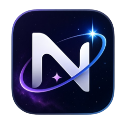
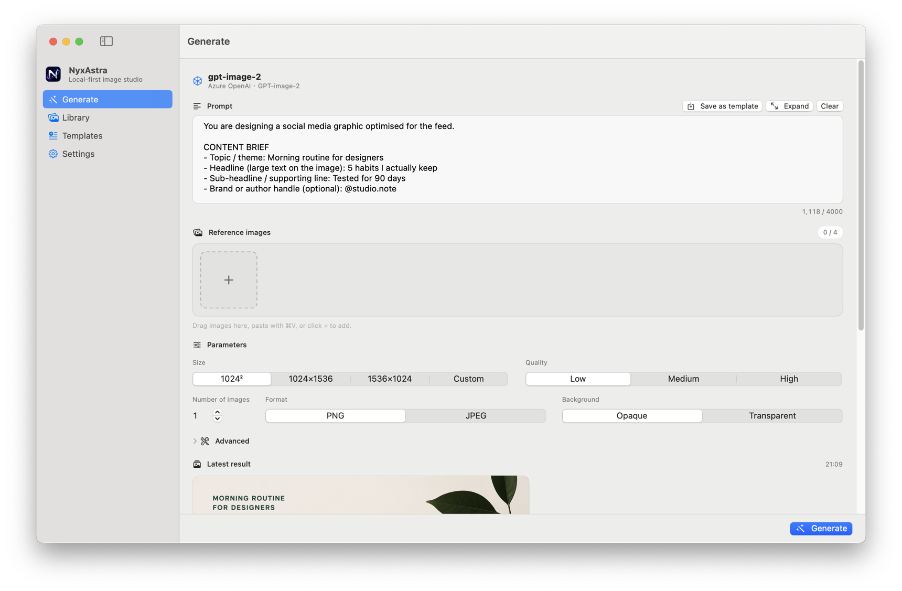
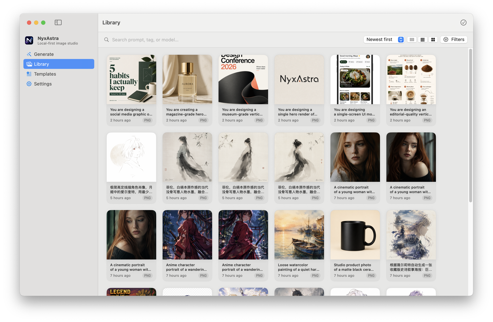
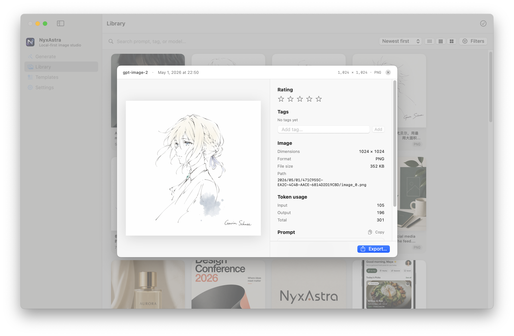
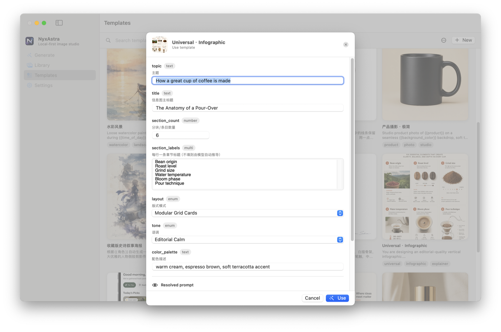

  

<h1 align="center">NyxAstra</h1>

  <strong>The AI image studio that stays on your device.</strong> 
  Generate stunning images with GPT-Image-2 — no cloud, no subscriptions, no data leaves your machine.

  
  &nbsp;&nbsp;
  
  &nbsp;&nbsp;
  

  
  
  
  
  
  
  

---

  <video src="assets/demo.mp4" width="720" autoplay loop muted playsinline>
    
  </video>

  

## Why NyxAstra?

Most AI image tools lock you into a web app, charge monthly fees, and route everything through their servers. **NyxAstra is different:**

- **Your API key, your control.** Connect your own OpenAI or Azure OpenAI account. No middleman, no markup.
- **Nothing leaves your device.** Zero telemetry. Zero analytics. Images and credentials are stored locally with encryption.
- **Desktop experience on macOS and Windows.** The macOS app is built with SwiftUI; the Windows port is built with WPF and .NET 10 as a self-contained x64 package.
- **Free.** No trials, no feature gates, no subscriptions.

---

## What you can do

### Generate up to 4K images

Full parameter control — quality, size, format, transparent backgrounds, moderation. Supports **gpt-image-2**, gpt-image-1.5, gpt-image-1, and gpt-image-1-mini.

  

### Edit with reference images

Drag & drop reference images to guide the AI. Perfect for style transfer, variations, and iterative refinement.

### Organize everything in the Library

Tag, rate, search, filter, batch export. Every image keeps its full generation metadata embedded in the file — prompt, parameters, token usage, model, and timestamp.

  

  

### One-click prompt templates

Don't start from a blank prompt. NyxAstra ships with **12 curated templates** covering universal briefs (poster, infographic, logo, UI mockup, product hero, social post) plus six recipe-style starters — cinematic portraits, pixel art, watercolor landscapes, product photography, minimal logo, and an editorial narrative poster. Each template has **fill-in variables** — just type your subject and hit Generate.

  

**Browse the full gallery → [gavinschneestudio.org/nyxastra/templates](https://gavinschneestudio.org/nyxastra/templates/)**

The gallery includes both the official starter pack and community-submitted templates. Click *Download* on any card to get the `.nyxtemplate` file. On macOS, double-click it to import into NyxAstra. On Windows, import it from the Templates workspace with the import button.

| | | |
|:---:|:---:|:---:|
|  |  |  |
| Event Poster | Infographic | Logo Concept |
|  |  |  |
| Product Hero Shot | Social Media Post | UI Mockup |

---

## Contribute your templates

NyxAstra templates are shareable `.nyxtemplate` files — and **everyone is welcome to contribute**. The full guide lives in [`community/CONTRIBUTING.md`](community/CONTRIBUTING.md); the short version:

1. **Design** a prompt in NyxAstra with `{{variables}}`
2. **Fill in the *Community Sharing* section** in the template editor (author, license, category)
3. **Export** it — right-click the template, choose *Export…*
4. **Submit** it — open a Pull Request that drops the file into [`community/templates/`](community/templates/), or [open a submission issue](https://github.com/GavinHarbus/nyxastra-app/issues/new?template=template_submission.yml) and a maintainer will help.

CI lints the file in a single round; a maintainer reviews, merges, and the next push to `main` rebuilds the gallery — credited to you under the license you choose.

---

## Privacy — by design, not by promise

| | |
|---|---|
| **Network** | Requests go only to the OpenAI / Azure endpoint *you* configure. Nothing else. |
| **Credentials** | Encrypted locally and never stored in plaintext: AES-256-GCM on macOS, Windows DPAPI on Windows. |
| **Storage** | App data stays on your device: the macOS app sandbox on macOS, `%LOCALAPPDATA%\NyxAstra` on Windows. |
| **Telemetry** | None. No analytics, no crash reporting, no phone-home. |
| **Backend** | No NyxAstra server. The app talks only to the provider endpoint you configure. |

Read the full [Privacy Policy](PRIVACY.md).

---

## Getting started

### macOS

1. **Download** the latest `.dmg` from [macOS Releases](https://github.com/GavinHarbus/nyxastra-app/releases)
2. **Drag** NyxAstra to your Applications folder
3. **Open** NyxAstra and go to Settings
4. **Paste** your OpenAI or Azure OpenAI API key
5. **Generate** your first image

> **macOS requirements:** macOS 14.0 (Sonoma) or later, Apple Silicon or Intel Mac, your own API key from [OpenAI](https://platform.openai.com/) or [Azure OpenAI](https://azure.microsoft.com/en-us/products/ai-services/openai-service).

### Windows

1. **Download** the latest Windows `.zip` from [Windows Releases](https://github.com/bbkgl/NyxAstraApp-Win/releases/latest)
2. **Extract** the package
3. **Run** the top-level `NyxAstra.exe` and keep the bundled `app` folder next to it
4. **Open** Settings and paste your OpenAI or Azure OpenAI API key
5. **Generate** your first image

> **Windows requirements:** Windows x64 and your own API key from [OpenAI](https://platform.openai.com/) or [Azure OpenAI](https://azure.microsoft.com/en-us/products/ai-services/openai-service). The release package is self-contained and includes the bundled .NET/WPF runtime; you do not need the .NET SDK to run it.

---

## Credits

Special thanks to [@bbkgl](https://github.com/bbkgl) for building the WPF/.NET Windows port of NyxAstra and publishing the Windows releases for users.

---

## More

- [Template Gallery](https://gavinschneestudio.org/nyxastra/templates/) — browse and download community templates
- [Community contributing guide](community/CONTRIBUTING.md) — submit your own templates
- [Windows Releases](https://github.com/bbkgl/NyxAstraApp-Win/releases/latest) — download the Windows build
- [Changelog](CHANGELOG.md) — what's new in each version
- [FAQ](FAQ.md) — common questions answered
- [Privacy Policy](PRIVACY.md) — the full details
- [Product Page](https://gavinschneestudio.org/products/nyxastra.html)

## Feedback & Support

Found a bug? Have an idea? [Open an issue](https://github.com/GavinHarbus/nyxastra-app/issues/new/choose) — every report helps make NyxAstra better.

---

  Made by <a href="https://gavinschneestudio.org/">Gavin Schnee Studio</a> 
  &copy; 2026 Gavin Schnee Studio. All Rights Reserved.

