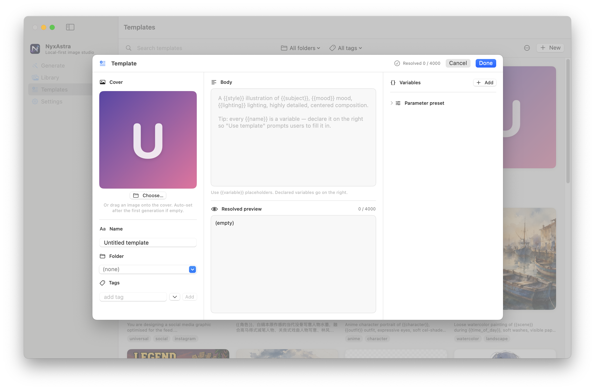
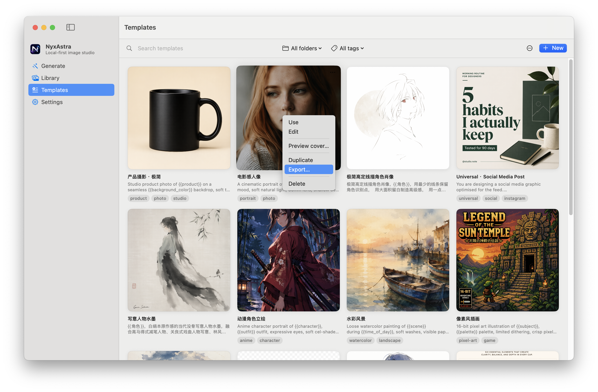

# Contributing a Template

Thanks for sharing! Submitting a community template takes a few minutes.

---

## Path A — submit via Pull Request (recommended)

### 1. Design your template in NyxAstra

Open NyxAstra, create a new template, and design the prompt with
`{{variable}}` placeholders. Give it a name, pick a folder, add a few
tags, and (optionally) set a parameter preset (size / quality / format)
that matches the style.

  

Test it — generate at least one image to confirm the variables and
parameter preset work end to end. Use the result you like best as the
**cover image** (right-click an image in the Library and choose
*Set as template cover*).

### 2. Export the `.nyxtemplate` file

Right-click the template → **Export…** and save the `.nyxtemplate` file
somewhere convenient. The exported file is a single self-contained JSON
document with the cover image embedded — no missing assets to worry
about.

  

### 3. Open a Pull Request

1. Fork this repository.
2. Drop your `.nyxtemplate` file into [`community/submissions/`](submissions/).
3. Commit with a message like `Add template: <name>`.
4. Open a Pull Request.

### 4. Wait for CI to do the boring work

Within a couple of minutes, the **NyxAstra Community CI** workflow will:

1. Lint the file (schema, variables, image validity, secret scan).
2. **Unpack** it into `community/templates/<slug>/`:
   - `template.json` — the prompt body, variables, parameter preset.
   - `cover.<format>` — the cover image, with EXIF metadata stripped.
   - `meta.yml` — author, license, category, tags, models. **You'll be asked to fill in the missing fields here in a follow-up commit.**
3. Delete your original `.nyxtemplate` from `submissions/`.
4. Push the unpacked files back to your PR branch.

### 5. Fill in the metadata

Edit the auto-generated `community/templates/<slug>/meta.yml` and complete:

- `author.name` — how you'd like to be credited (handle, real name,
  or `Anonymous`).
- `author.url` — *optional* link to your profile. Must be `https://`
  on one of these hosts: `github.com`, `x.com` / `twitter.com`,
  `bsky.app`, `mastodon.social`, `xiaohongshu.com`, `bilibili.com` /
  `space.bilibili.com`, or `gavinschneestudio.org`. Other hosts are
  rejected by CI to keep the gallery free of phishing / SEO spam.
  Need a host added? Open an issue or include the rationale in your PR.
- `license` — choose one (see [Licenses](#licenses) below).
- `category` — `photo` / `illustration` / `branding` / `universal` / `other`.
- `models` — which models this works best with.
- `locale` — `en`, `zh-CN`, `ja`, … or `universal` if language-agnostic.

Push the edited `meta.yml` to the same PR.

### 6. Review

A maintainer will review for content policy, quality, and whether it
duplicates an existing template. We may suggest small edits or
adjustments to the metadata. Once merged, your template appears in the
gallery on the next site rebuild.

---

## Path B — open an issue (no git required)

If you don't use git, [open an issue using the **Submit a template**
template][issue-template] and attach your `.nyxtemplate` file. A
maintainer will create the Pull Request for you and credit the
authorship to whoever you specify.

[issue-template]: https://github.com/GavinHarbus/nyxastra-app/issues/new?template=template_issue.yml

---

## What makes a good template?

| ✅ Yes | ❌ No |
|---|---|
| A clear, reusable prompt with named variables | A one-off prompt for a single image |
| Cover image generated with the template itself | Cover image taken from another source |
| Variables that meaningfully change the output | Variables that don't affect anything |
| Parameter preset matched to the style (size, quality) | Random parameter preset |
| 1–8 variables (more becomes a chore to fill) | 20+ micro-variables |
| Works on at least two of `gpt-image-2` / `1.5` / `1` | Only works on a deprecated model |

---

## Licenses

Pick one in `meta.yml`:

| License | Meaning |
|---|---|
| `CC0-1.0` | Public domain. Anyone can use, modify, redistribute, commercially or otherwise. |
| `CC-BY-4.0` | Free to use; attribution required. **Recommended for most contributions.** |
| `CC-BY-SA-4.0` | Free to use; attribution required; derivatives must use the same license. |
| `All Rights Reserved` | Visible in the gallery but no permission to redistribute or modify. *Not recommended.* |

If you don't pick a license, the maintainers will assume `CC-BY-4.0`
and credit you as the author.

---

## Code of conduct

Be kind, assume good faith, and follow the
[content policy](CONTENT_POLICY.md). Reviewers are humans donating their
time — feedback may take a few days.

Thanks again for contributing!
