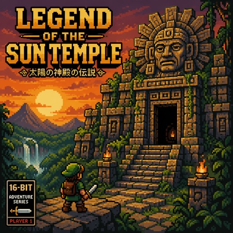
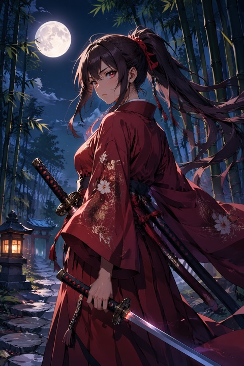
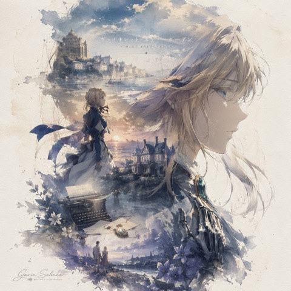
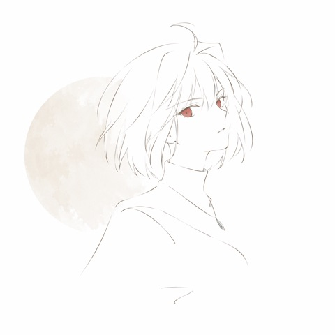
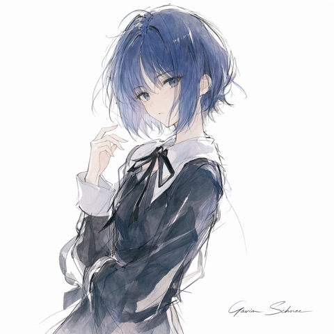

# Illustration Templates

Anime, watercolor, pixel art, posters, ink art, and more.

> **How to use:** Click a `.nyxtemplate` file → Download → Double-click to import into NyxAstra.

---

## 像素风插画

16-bit pixel art illustration of palette limited dithering crisp pixels retro game cover composition no anti-aliasing.

**Variables:** `subject`, `palette`

  

[Download template](%E5%83%8F%E7%B4%A0%E9%A3%8E%E6%8F%92%E7%94%BB.nyxtemplate)

---

## 动漫角色立绘

Anime character portrait of outfit expressive eyes soft cel-shaded lighting vibrant colors detailed background featuring...

**Variables:** `character`, `outfit`, `setting`

  

[Download template](%E5%8A%A8%E6%BC%AB%E8%A7%92%E8%89%B2%E7%AB%8B%E7%BB%98.nyxtemplate)

---

## 收藏版史诗叙事海报

根据自动生成一张收藏版史诗叙事海报：巨大优雅的人物侧脸剪影作为外轮廓 剪影内部自动生长出最契合该主题的完整世界观、标志性场景、角色关系、象征符号、关键建筑、生物、道具与氛围。

**Variables:** `角色`, `签名`

  

[Download template](%E6%94%B6%E8%97%8F%E7%89%88%E5%8F%B2%E8%AF%97%E5%8F%99%E4%BA%8B%E6%B5%B7%E6%8A%A5.nyxtemplate)

---

## 极简高定线描角色肖像

极简高定线描角色肖像 用最少的线条保留角色识别点 用大面积留白制造高级感 用一点点淡彩或淡墨压住视觉重心。

**Variables:** `签名`, `角色`

  

[Download template](%E6%9E%81%E7%AE%80%E9%AB%98%E5%AE%9A%E7%BA%BF%E6%8F%8F%E8%A7%92%E8%89%B2%E8%82%96%E5%83%8F.nyxtemplate)

---

## 水彩风景

Loose watercolor painting of during soft washes visible paper texture gentle pigment bleeds muted complementary palette.

**Variables:** `scene`, `time_of_day`

  

[Download template](%E6%B0%B4%E5%BD%A9%E9%A3%8E%E6%99%AF.nyxtemplate)

---

## 线性人物彩色插画

东亚书写性线性人物彩色插画 白描骨架 线描主导 写意淡设色 毛笔墨线 兼毫笔触 中锋行笔 局部侧锋擦出 飞白笔意 枯笔质感 游丝描发丝 开放式轮廓 断续复线 虚实相生 书写性强 线性优先 笔意主导造型 大面积留白 白底纸面构图 计白当黑 纸...

**Variables:** `角色`, `签名`

  

[Download template](%E7%BA%BF%E6%80%A7%E4%BA%BA%E7%89%A9%E5%BD%A9%E8%89%B2%E6%8F%92%E7%94%BB.nyxtemplate)
